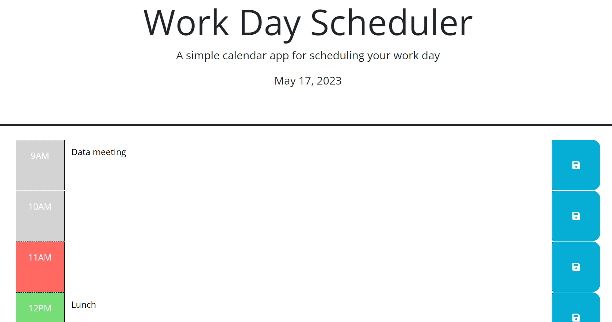

# Work-Day-Scheduler

## Description

A calendar app to help schedule the workday.

## Installation

N/A

## Usage

To use the calendar, open ([Work Day Scheduler](https://lexigeller.github.io/Work-Day-Scheduler/)) in a browser. The current date will be displayed. There are 9 time blocks, from 9 am to 5 pm, to represent a typical work day. Each time block is color coded dynamically depending on the current hour: gray for a past hour, red for the current hour, and green for future hours. Next to each time block is a text area that can be typed into to track tasks for each hour. These can be saved with the save buttons.

## Credits

N/A

## License

Please refer to the LICENSE in the repo.
